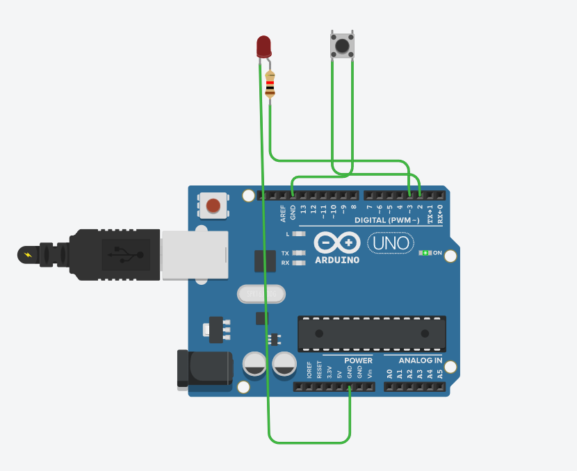

# Push Button Controlled LED

## Overview

This project demonstrates how to control an LED using a push button connected to an Arduino Uno.

## Components Used

- Arduino Uno
- Push Button
- LED
- 220Ω Resistor
- 10kΩ Resistor
- Jumper Wires

## Concepts Learned

- Digital Input
- Digital Output
- `digitalRead()`
- `digitalWrite()`
- Conditional Logic (`if`)

## Files

- `Push_Button_Controlled_LED.ino` – Arduino source code
- `Push_Button_Controlled_LED_Circuit.png` – Tinkercad circuit screenshot

## Circuit Diagram

