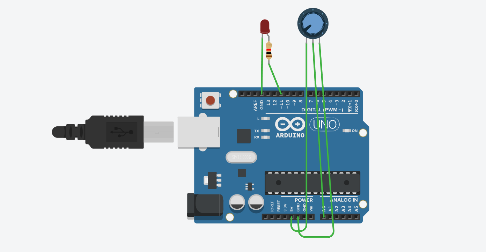

# PWM Brightness Control

## Overview

This project demonstrates how to control the brightness of an LED using Pulse Width Modulation (PWM)
with a potentiometer on an Arduino Uno. The potentiometer value is read as an analog input and used to adjust
the LED brightness in real time.

## Components Used

- Arduino Uno
- LED
- 220Ω Resistor
- Potentiometer (10kΩ)
- Jumper Wires

## Concepts Learned

- Analog Input
- Pulse Width Modulation (PWM)
- `analogRead()`
- `analogWrite()`
- PWM Pins

## Files

- `PWM_Brightness_Control.ino` – Arduino source code
- `PWM_Brightness_Control_Circuit.png` – Tinkercad circuit screenshot

## Circuit Diagram

