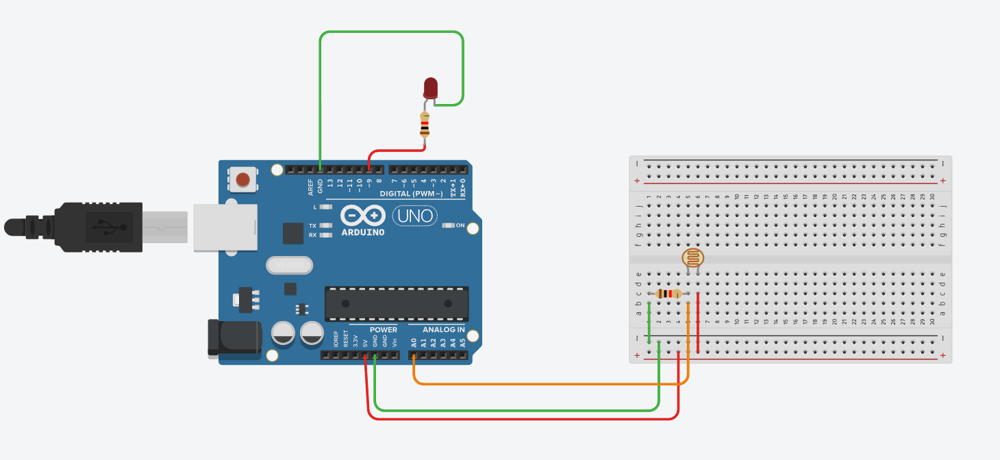

# Smart Desktop Companion Lamp

## Overview

The Smart Desktop Companion Lamp automatically turns on an LED when the surrounding environment becomes dark using an LDR (Light Dependent Resistor). This project demonstrates automatic lighting control based on ambient light intensity.

## Components Used

- Arduino Uno
- LDR (Light Dependent Resistor)
- LED
- 220Ω Resistor
- 10kΩ Resistor
- Breadboard
- Jumper Wires

## Working

- Reads ambient light using the LDR.
- Compares the sensor value with a predefined threshold.
- Turns the LED ON when the surroundings become dark.
- Turns the LED OFF when sufficient light is detected.

## Concepts Learned

- Analog Input
- LDR Sensor
- Voltage Divider
- Threshold Detection
- Digital Output
- if-else Statements

## Circuit Diagram

## Author

Rakshak Trehan
