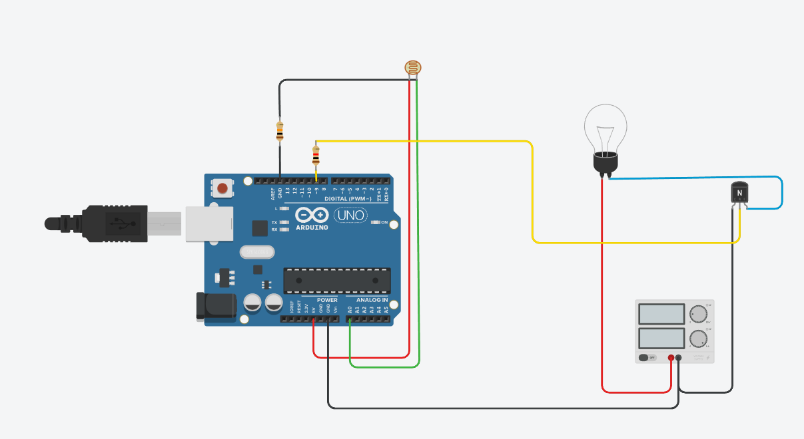

# Smart Street Light

## Overview

The Smart Street Light automatically turns an LED ON or OFF based on the surrounding light intensity using an LDR (Light Dependent Resistor). It demonstrates automatic lighting control commonly used in energy-efficient street lighting systems.

---

## Components Used

- Arduino Uno
- LDR (Photoresistor)
- 10kΩ Resistor
- LED
- 220Ω Resistor
- Breadboard
- Jumper Wires

---

## Working

- The LDR continuously senses ambient light.
- During daytime (high light intensity), the LED remains OFF.
- During nighttime (low light intensity), the LED turns ON automatically.

---

## Concepts Learned

- Analog Input
- LDR Sensor Interfacing
- Voltage Divider
- Conditional Statements
- Digital Output
- Embedded Automation

---

## Circuit Diagram

