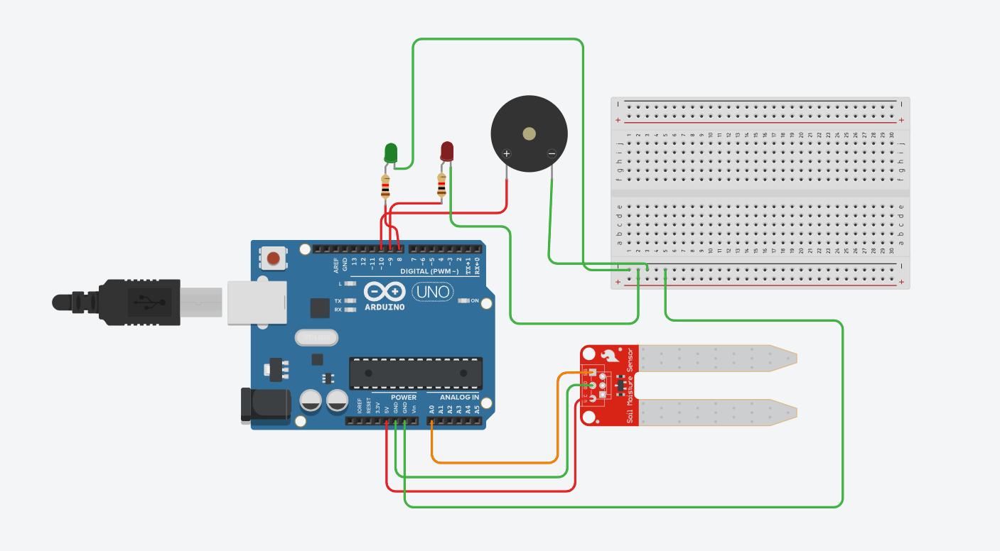

# Soil Moisture Alarm

## Overview

The **Soil Moisture Alarm** is an Arduino-based monitoring system that continuously measures soil moisture using a soil moisture sensor. When the moisture level falls below a predefined threshold, the system alerts the user through a red LED and buzzer, indicating that watering is required. A green LED indicates normal soil conditions.

---

## Features

- Real-time soil moisture monitoring
- Automatic dry soil detection
- Visual status indication using LEDs
- Audible alert using a buzzer
- Adjustable moisture threshold in software

---

## Components Used

- Arduino Uno
- Soil Moisture Sensor
- Green LED
- Red LED
- Active Buzzer
- 220Ω Resistors
- Breadboard
- Jumper Wires

---

## Pin Connections

| Component | Arduino Pin |
|----------|------------|
| Soil Moisture Sensor | A0 |
| Green LED | D8 |
| Red LED | D9 |
| Active Buzzer | D10 |

---

## Working Principle

1. The soil moisture sensor continuously measures the moisture level.
2. Arduino reads the analog sensor value.
3. The measured value is compared with a predefined threshold.
4. If the soil is dry:
   - Red LED turns ON
   - Buzzer sounds
   - Green LED turns OFF
5. If sufficient moisture is detected:
   - Green LED turns ON
   - Red LED turns OFF
   - Buzzer remains OFF

---

## Concepts Demonstrated

- Analog Sensor Interfacing
- Threshold-Based Decision Making
- Conditional Programming
- LED Status Indicators
- Buzzer Control
- Environmental Monitoring

---

## Circuit Diagram

---

## Applications

- Smart Irrigation Systems
- Home Plant Monitoring
- Greenhouse Automation
- Agricultural Monitoring
- Precision Farming

